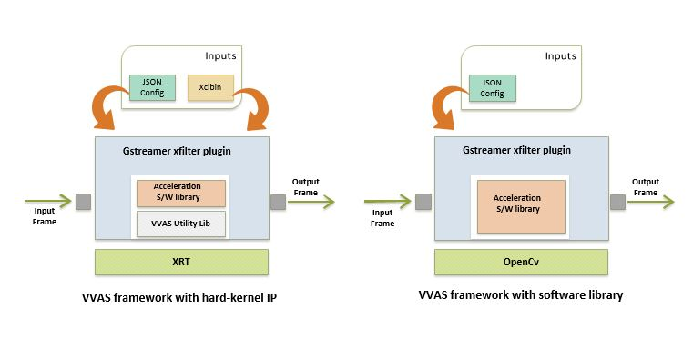
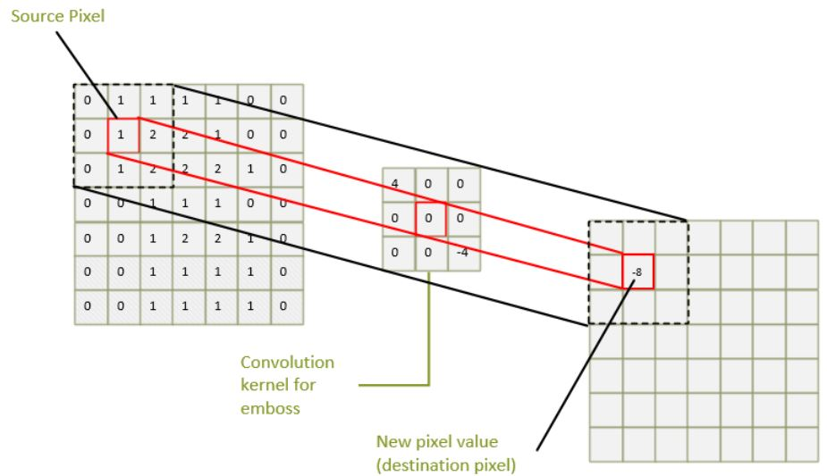

Accelerator - 2D Filter
========================

This chapter provides the hardware and software architecture of the  2D Filter
accelerator integrated into a platform.

Software Architecture
---------------------

The accelerator uses Vitis Video Analytics (VVAS) as a framework to realize tranform and AI-powered
solutions that can easily and seamlessly interface with other GStreamer elements such as video sources and sinks.
VVAS provides a simplified interface to developers, exposing certain API to program the accleration kernel without having to worry
about handeling buffer allocations.

**vvas_xfilter** is a generic VVAS infrastructure plugin that interact with the acceleration kernel through a set
of APIs exposed by an acceleration software library corresponding to that kernel.
An accelerator element has one source and one sink pad; vvas_xfilter can consume one temporal input
frame from its source pad, data transform and produce one output frame on its sink pad.
vvas_xfilter plug-in wraps the acceleration software library and prepares the acceleration software library handle (VVASKernel)
to be passed to the core APIs as shown in the figure.

The vvas_xfilter plug-in provide many input properties to config the kerenl. Below are significant

- kernels-config (mandatory) : Is a path to configuration file in JSON format and contains information required by the kernel, such as path to xclbin, acceleration software library and many more.

- dynamic-config (optional) : configures one or many input parameters of the kernel during runtime, refer to all parameters under config from the JSON file above.

**Acceleration software libraries** :
vvas_xfilter loads the shared acceleration software library, where  acceleration software library controls the
acceleration kernel, like register programming, or any other core logic that is required to implement the transform functions.

**vvas_xfilter2d_sw** is a shared acceleration software library that uses OpenCV libraries to perform filter2d computation as a pure software implmentation performed on the APU cores.

**vvas_xfilter2d_pl** is a shared acceleration software library that operates on PL-based kernel obtained by high level synthesis (HLS) from  Xilinx Vitis Vision libraries.

below are the examples where VVAS framework is used with an acceleration software library developed for a hard-kernel IP / software library (e.g., OpenCV)

AIE uses Tiler and Stitcher in the PL, generic VVAS infrastructure plugins along with Software acceleration libraries program the PL Tiler-Stitcher Kernel-IP, while memory allocation
and return are taken care by VVAS.

For detailed documentaion of VVAS infrastructure plugins, plugin properties and JSON configuration file refer the below URL
https://xilinx.github.io/VVAS/index.html

Hardware Architecture
---------------------

A memory-to-memory (M2M) pipeline reads video frames from memory, does certain
processing, and then writes the processed frames back into memory. A block diagram
of the processing pipeline is shown in the following figure.

.. image:: ../images/2dfilter_hw.jpg
  :width: 1000
  :alt: 2d Filter Processing Pipeline Diagram

The processing pipeline implements filter funtions

* 2D convolution filter implemented in PL along with a data mover (DM)
* 2D convolution filter implemented in AIE along with a Tiler and Stitcher in PL

The memory-to-memory (m2m) processing pipeline with the 2D convolution filter is
generated and integrated by the Vitis™ tool. The C-based 2D filter function is
translated to RTL and then packaged as kernel object (.xo) using Vitis™ HLS.
For the 2D Convolution filter in AIE the datamovers used are tiler.xo and stitcher.xo.
The AIE compiler generates the connectivity graph (.adf) with the AIE engine and
the program (2D convolution filter elf) to execute on AIE. The Vitis™ tool uses the
.xo and .adf outputs from these tools and integrates the IPs into the platform.

For more information on 2D Convolution filter in PL refer to
`Vitis Vision Library: Custom Convolution <https://xilinx.github.io/Vitis_Libraries/vision/2022.1/overview.html#>`_

For more information on 2D Convolution filter in AIE refer to
`Vitis Vision AIE Library User Guide <https://xilinx.github.io/Vitis_Libraries/vision/2022.1/overview-aie.html#>`_

The data movers read input frames from the memory. The processing block runs
convolution on the frame. Convolution is a common image processing technique that
changes the intensity of a pixel to reflect the intensities of the surrounding pixels.
This is widely used in image filters to achieve popular image effects like blur,
sharpen, and edge detection.

The implemented algorithm uses a 3x3 kernel with programmable filter coefficients.
The coefficients inside the kernel determine how to transform the pixels from
the original image into the pixels of the processed image, as shown in the
following figure.

The algorithm performs a two-dimensional (2D) convolution for each pixel of the
input image with a 3x3 kernel. Convolution is the sum of products, one for each
coefficient/source pixel pair. As the reference design is using a 3x3 kernel, in
this case it is the sum of nine products.

The result of this operation is the new intensity value of the center pixel
in the output image. This scheme is repeated for every pixel of the image in
raster-scan order, that is, line-by-line from top-left to bottom-right.
In total, width x height 2D convolution operations are performed to process
the entire image.

The pixel format used in this design is YUYV which is a packed format with 16
bits per pixel. Each pixel can be divided into two 8-bit components: one for
luma (Y), the other for chroma (U/V alternating).

In this implementation, only the Y component is processed by the 2D convolution
filter which is essentially a grayscale image. The reason is that the human eye
is more sensitive to intensity than color. The combined U/Y components which
accounts for the color is merged back into the final output image unmodified.
The processed frame is then written back to memory by the datamover.

,,,,,

Licensed under the Apache License, Version 2.0 (the "License"); you may not use this file
except in compliance with the License.

You may obtain a copy of the License at
http://www.apache.org/licenses/LICENSE-2.0

Unless required by applicable law or agreed to in writing, software distributed under the
License is distributed on an "AS IS" BASIS, WITHOUT WARRANTIES OR CONDITIONS OF ANY KIND,
either express or implied. See the License for the specific language governing permissions
and limitations under the License.

