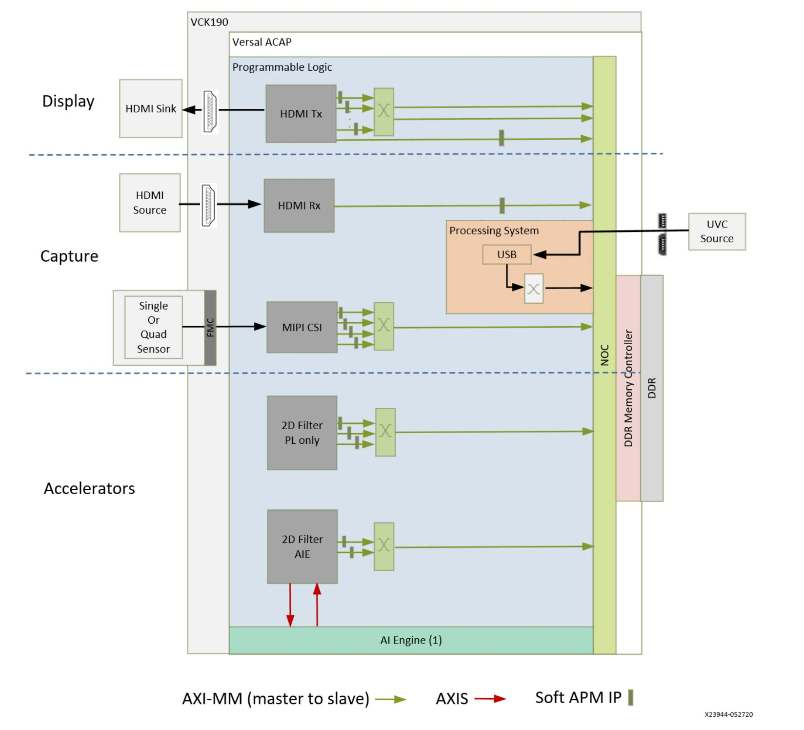
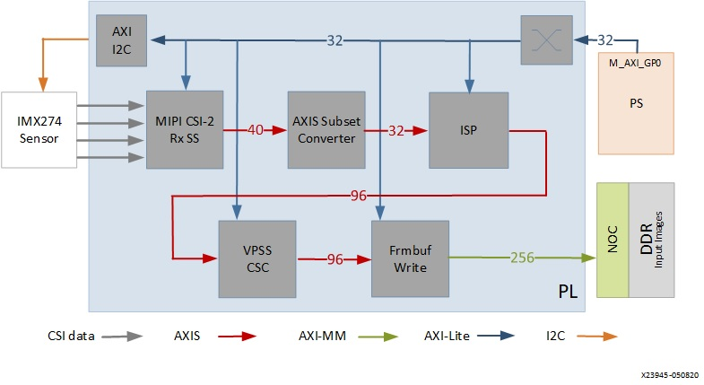
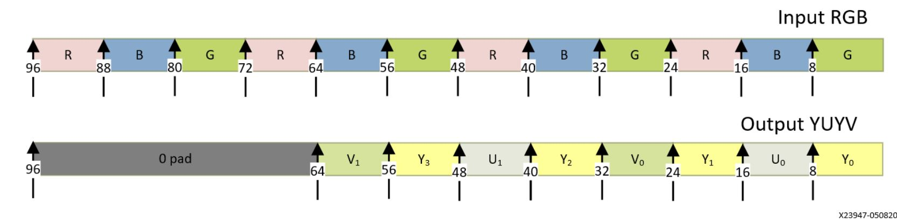
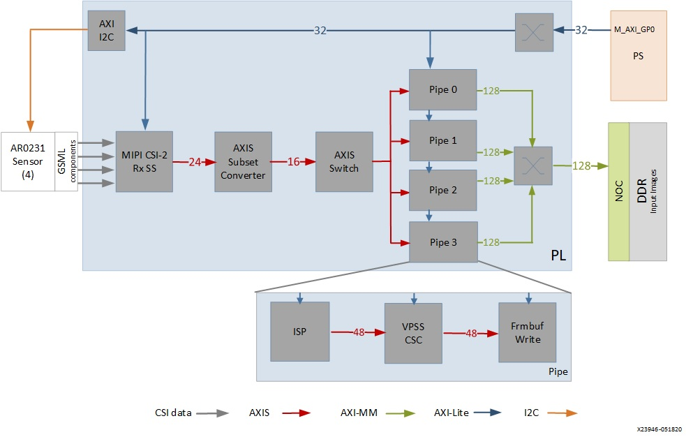
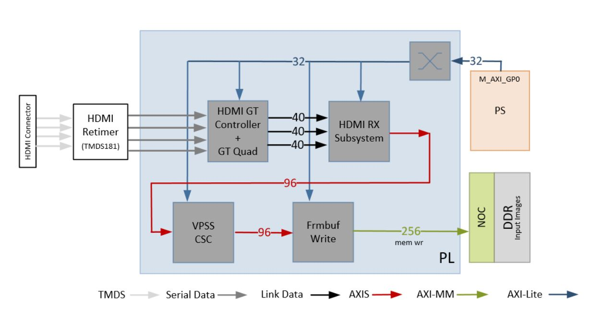
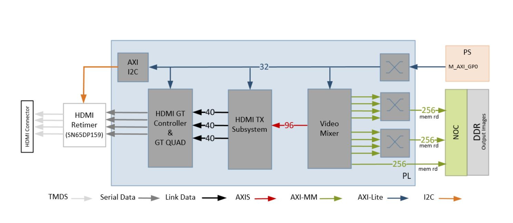
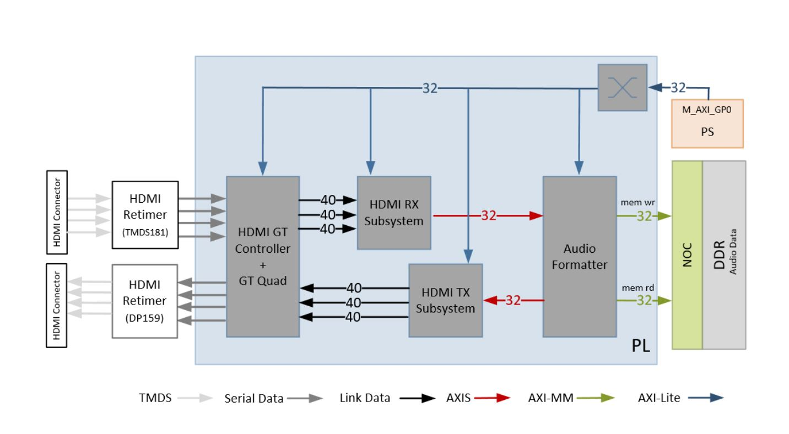

Hardware Architecture of the Platform
=====================================

This chapter describes the targeted reference design (TRD) hardware architecture.
The following figure shows a block diagram of the design components inside the
Versal ACAP on the VCK190 board. See VCK190 Evaluation Board User Guide (`UG1366 <https://www.xilinx.com/support/documentation/boards_and_kits/vck190/ug1366-vck190-eval-bd.pdf>`_)
for more information.

At a high level, the design comprises three pipelines:

Capture/input pipeline:

* USB capture pipeline (PS)

* Single or quad MIPI CSI-2 Rx capture pipeline (FMC + PL)

* HDMI RX video and audio capture pipeline

Processing Pipeline:

* Video processing accelerator funtions

Display/Output Pipeline:

* HDMI TX display pipeline

* HDMI RX audio pipeline

The block diagram comprises of two parts: platforms and accelerators.

Platforms:

This mainly consist of I/O interfaces and their data motion network.
This is the fixed part of the design. Platforms supported in this reference design:

* Platform 1: Single sensor MIPI CSI-2 Rx (capture), USB-UVC (capture), HDMI Tx (display)

* Platform 2: Quad sensor MIPI CSI-2 Rx (capture), USB-UVC (capture), HDMI Tx (display)

* Platform 3: HDMI Rx (capture), USB-UVC (capture), HDMI Tx (display)

Accelerators:

This is a block which can perform different video processing functions from Computer
Vision or Machine learning. This is the variable part of the design. The accelerator
and corresponding data/control interfaces (AXI-MM, AXI-Lite, interrupts)
are generated by the Vitis tool and is integrated into the platform.

Capture Pipeline
----------------
Single Sensor MIPI Capture
^^^^^^^^^^^^^^^^^^^^^^^^^^

A capture pipeline receives frames from an external source and writes it into memory.
The single sensor MIPI CSI-2 receiver capture pipeline is shown in the following figure.

This pipeline consists of five components, of which four are controlled by the APU
via an AXI-Lite based register interface; one is controlled by the APU via an I2C
register interface.

* The `Sony IMX274 <https://leopardimaging.com/product/li-imx274-mipi-cs/>`_ is a 1/2.5 inch CMOS digital image sensor with an active imaging
  pixel array of 3864H x2196V. The image sensor is controlled via an I2C interface
  using an AXI I2C controller in the PL. It is mounted on a FMC daughter card and
  has a MIPI output interface that is connected to the MIPI CSI-2 RX subsystem
  inside the PL. For more information refer to the `LI-IMX274MIPI-FMC_datasheet <https://www.leopardimaging.com/uploads/LI-IMX274-MIPI-CS_datasheet.pdf>`_.

* The MIPI CSI-2 receiver subsystem (CSI Rx) includes a MIPI D-PHY core that connects
  four data lanes and one clock lane to the sensor on the FMC card. It implements a
  CSI-2 receive interface according to the MIPI CSI-2 standard v2.0 with underlying
  MIPI D-PHY standard v1.2. The subsystem captures images from the IMX274 sensor in
  RAW10 format and outputs AXI4-Stream video data. For more information see the MIPI
  CSI-2 Receiver Subsystem Product Guide (`PG232 <https://www.xilinx.com/support/documentation/ip_documentation/mipi_csi2_rx_subsystem/v5_0/pg232-mipi-csi2-rx.pdf>`_).

* The HDR extract block takes single digital overlapped frame from the sensor as input 
  and returns two output exposure frames - Short Exposure Frame and a Long Exposure Frame.
  For more information on this function refer to `Vitis Vision Libraries HDR Extract exposure frames <https://xilinx.github.io/Vitis_Libraries/vision/2022.1/api-reference.html#extract-exposure-frames>`_.
  
* Creating High Dynamic Range images requires at least two frames that are captured with 
  different exposure times. HDR Merge module will generate the HDR frame with these varied 
  exposure frames. HDR Merge in RGB domain is complex and expensive in terms of latency, 
  because of camera response function. Hence the current module works in Bayer domain.
  For information on this function refer to `Vitis Vision Libraries HDR Merge <https://xilinx.github.io/Vitis_Libraries/vision/2022.1/api-reference.html#hdr-merge>`_.

* The Image Single Processing IP is available in the Vitis Vision librarires
  (https://github.com/Xilinx/Vitis_Libraries/tree/master/vision/L1).The IP receives the
  RAW10 AXI4-Stream input data and interpolates the missing color components for every
  pixel to generate a 24-bit, 8 bits per pixel (8 bpc) RGB output image transported via
  AXI4-Stream. At 4 ppc, the AXIS width is 96-bit. A GPIO from the PS is used to reset
  the IP between resolution changes. For information on the functions it implments
  refer to `Vitis Vision Libraries Image Sensor Processing pipeline <https://xilinx.github.io/Vitis_Libraries/vision/2022.1/overview.html#isp-201>`_.

* The video processing subsystem (VPSS), see Video Processing Subsystem Product Guide
  (`PG231 <https://www.xilinx.com/support/documentation/ip_documentation/v_proc_ss/v2_0/pg231-v-proc-ss.pdf>`_),
  is a collection of video processing IP subcores. This instance uses the
  scaler only configuration which provides scaling, color space conversion, and chroma
  resampling functionality. The VPSS takes AXI4-Stream input data in 24-bit RGB format
  and converts it to a 16-bit, 8bpc YUV 4:2:2 output format. The following figure shows
  AXIS data interface at 4ppc. A GPIO pin from the PS is used to reset the subsystem
  between resolution changes.

* The video frame buffer, see Video Frame Buffer Read and Video Frame Buffer Write
  LogiCORE IP Product Guide (`PG278 <https://www.xilinx.com/support/documentation/ip_documentation/v_frmbuf/v1_0/pg278-v-frmbuf.pdf>`_)
  takes YUV 4:2:2 sub-sampled AXI4-Stream input data
  and converts it to AXI4-MM format which is written to memory as 16-bit packed YUYV.
  The AXI-MM interface is connected to the system DDR via NOC. For each video frame
  transfer, an interrupt is generated. A GPIO is used to reset the IP between
  resolution changes.

All the IPs in this pipeline are configured to transport 4ppc @ 150 MHz, enabling up to
3840x2160 resolution at 30 HDR frames per second (fps). Each HDR frame is a composite
of a long exposure frame and a short exposure frame, so effective frame rate is 60fps.

* Time to transfer one frame: (3840 + 560) x (2160 + 90) / (150 MHz * 4ppc) = 0.0165 ms
* Number of frames transferred per second = 1/0.0165 = 60 frames

Note: In this calculation the vertical blanking accounts for 90 pixels per line and the
horizontal blanking for 560 lines per video frame.

The video resolution, frame format and frame rate are set via register writes through
the AXI-Lite interface of the IPs at run-time. The drivers for the above blocks provide
APIs to set these values in a user application.

* For the pass-through design (no accelerator) user can choose between 720p60, 1080p60,
  and 2160p30.

Quad Sensor MIPI Capture
^^^^^^^^^^^^^^^^^^^^^^^^

The quad sensor MIPI CSI-2 receiver capture pipeline is shown in the following figure.

* The `Avnet Multicamera FMC module <https://www.avnet.com/wps/portal/silica/products/new-products/npi/2018/avnet-multi-camera-fmc-module/>`_ bundles fours ON Semi image sensors (`AR0231 <https://www.avnet.com/wps/portal/silica/products/new-products/npi/2018/on-semiconductor-ar0231at>`_) with
  GMSL (Gigabit Multimedia Serial Link) serializers (`MAX96705 <https://datasheets.maximintegrated.com/en/ds/MAX96705.pdf>`_)
  and deserialzer (`MAX9286 <https://www.maximintegrated.com/en/products/interface/high-speed-signaling/MAX9286.html>`_).

* The MIPI CSI-2 subsystem, see the MIPI CSI-2 Receiver Subsystem Product Guide (`PG232 <https://www.xilinx.com/support/documentation/ip_documentation/mipi_csi2_rx_subsystem/v5_0/pg232-mipi-csi2-rx.pdf>`_),
  captures images from the deserializer in RAW12 format on four lanes and outputs
  AXI4- Stream video data.

* The AXI subset converter converts the raw 12-bit (RAW12) AXI4-Stream input data to
  raw 10- bit (RAW10) AXI4-Stream output data by truncating the four least significant
  bits (LSB) of each data word. The AXIS switch splits the incoming data into four
  streams using the destination id.

* The ISP IP receives the RAW AXI4-Stream input data and interpolates the missing color
  components for every pixel to generate a 24-bit, 8 bits per pixel (8 bpc) RGB output
  image transported via AXI4-Stream. For more information refer to `Vitis Vision Libraries Image
  Sensor Processing pipeline <https://xilinx.github.io/Vitis_Libraries/vision/2022.1/overview.html#isp-201>`_.

* The VPSS takes AXI4-Stream input data in 24-bit RGB format and converts it to a
  16-bit, 8 bpc YUV 4:2:2 output format.

* The video frame buffer takes YUV 4:2:2 sub-sampled AXI4-Stream input data and converts
  it to AXI4-MM format which is written to memory as 16-bit packed YUYV.

All of the IPs in this pipeline are configured to transport 2 ppc @ 150 MHz, enabling up
to 1920x1080 resolution at 120 fps, or 30 fps per stream.

* Time to transfer one frame: (1920 + 280) x (1080 + 45) / (150 MHz * 2 ppc) = 0.00825 ms
* Number of frames transferred per second = 1/0.00825 = 120 frames

Note: The `AR0231 sensor <https://www.avnet.com/wps/portal/silica/products/new-products/npi/2018/on-semiconductor-ar0231at>`_ is limited to 1080p30 applications.

HDMI Rx Capture
----------------

The HDMI receiver capture pipeline is shown in the following figure.

This pipeline consists of four main components, each of them controlled by the APU via an AXI4- Lite base register interface:

* The HDMI retimer converts TMDS data from the HDMI connector to serial data and clock,
  and provides them to the GT QUAD.

* The HDMI GT controller and PHY (GT QUAD) enable plug-and-play connectivity with the
  video transmit or receive subsystems. The interface between the media access
  controller (MAC) and physical (PHY) layers are standardized to enable ease of use in
  accessing shared gigabit-transceiver (GT) resources. The data recovery unit (DRU)
  supports lower line rates for the HDMI protocol. An AXI4-Lite register interface is
  provided to enable dynamic accesses of transceiver controls/status. See the HDMI GT
  Controller LogiCORE IP Product Guide (`PG334 <https://www.xilinx.com/support/documentation/ip_documentation/hdmi_gt_controller/v1_0/pg334-hdmi-gt-controller.pdf>`_) for more information. The HDMI GT
  controller and PHY are shared with the HDMI TX display pipeline

* The HDMI receiver subsystem (HDMI RX) interfaces with PHY layers and provides HDMI
  decoding functionality. The subsystem is an hierarchical IP that bundles a collection
  of HDMI RX-related IP subcores and outputs them as a single IP. The subsystem receives
  the captured TMDS data from the PHY layer. It then extracts the video stream from the
  HDMI stream and generates a 96-bit AXI4-Stream data stream corresponding to four
  pixels per clock. The data format is dependent on the HDMI source format. See the HDMI
  1.4/2.0 Receiver Subsystem Product Guide (`PG236 <https://www.xilinx.com/support/documentation/ip_documentation/v_hdmi_rx_ss/v3_1/pg236-v-hdmi-rx-ss.pdf>`_) for more information.

* The video processing subsystem (VPSS) is a collection of video processing IP subcores.
  This instance of the VPSS uses the video scaler only configuration which provides
  scaling, color space conversion, and chroma resampling functionality. The VPSS takes
  AXI4-Stream input data from the HDMI RX subsystem and depending on the input format
  and  resolution, converts and scales it to YUV 4:2:2 format transferred on a 96-bit
  AXI4-Stream interface. A GPIO is used to reset the subsystem between resolution
  changes. See the Video Processing Subsystem Product Guide (`PG231 <https://www.xilinx.com/support/documentation/ip_documentation/v_proc_ss/v2_0/pg231-v-proc-ss.pdf>`_) for more information.

* The video frame buffer takes YUV 4:2:2 sub-sampled AXI4-Stream input data and
  converts it to AXI4-MM format which is written to memory as 16-bit packed YUYV. The
  AXI-MM interface is connected to the system DDR via the NOC. An interrupt is generated
  for each video frame transfer. A GPIO is used to reset the IP between resolution
  changes. See the   Video Frame Buffer Read and Video Frame Buffer Write LogiCORE IP
  Product Guide (`PG278 <https://www.xilinx.com/support/documentation/ip_documentation/v_frmbuf/v1_0/pg278-v-frmbuf.pdf>`_) for more information.

All of the IPs in this pipeline are configured to transport 4ppc @ 150 MHz, enabling up
to 3840x2160 resolution at 60 frames per second (fps).

* Time to transfer one frame: (3840 + 560) x (2160 + 90) / (150 MHz * 4ppc) = 0.0165 ms
* Number of frames transferred per second = 1/0.0165 = 60 frames

Display Pipeline
-----------------

An output pipeline reads video frames from memory and sends the frames to a sink. In this
case the sink is a display and therefore this pipeline is also referred to as a display
pipeline. The HDMI display pipeline is shown in the following figure.

This pipeline consists of three main components, all of them controlled by the APU via
an AXI- Lite base register interface:

* The video mixer IP core is configured to support blending of up to eight overlay
  AXI4 interfaces connected to the NOC via two interconnects. Two interconnects are
  required to reduce arbitration across ports. The main AXI-MM layer has the resolution
  set  to match the display. The other layers, whatever their resolution, is blended
  with this layer. Four videolayers are configured for YUYV and the other four are
  configured for RGB. The AXI4-Stream output interface is a 96-bit bus that transports
  4ppc for up to 2160p60 performance. It is connected to the HDMI Tx subsystem input
  interface. A GPIO is used to reset the subsystem between resolution changes. For more
  information refer to the input interface Video Mixer LogiCORE IP Product Guide (`PG243 <https://www.xilinx.com/cgi-bin/docs/ipdoc?c=v_mix%3Bv%3Dlatest%3Bd%3Dpg243-v-mix.pdf>`_).

Note: The mixer configuration remains the same for different capture sources. To enable/
disable various layers, software programs the layer enable register in the IP

* The HDMI transmitter subsystem (HDMI Tx) interfaces with PHY layers and provides HDMI
  encoding functionality. The subsystem is a hierarchical IP that bundles a collection
  of HDMI TX-related IP sub-cores and outputs them as a single IP. The subsystem
  generates an HDMI stream from the incoming AXI4-Stream video data and sends the
  generated link data to the video PHY layer. For more information refer to the HDMI 1.4/
  2.0 Transmitter Subsystem Product Guide (`PG235 <https://www.xilinx.com/cgi-bin/docs/ipdoc?c=v_hdmi_tx_ss%3Bv%3Dlatest%3Bd%3Dpg235-v-hdmi-tx-ss.pdf>`_).

* The HDMI GT controller and PHY (GT) enables plug-and-play connectivity with the video
  transmit or receive subsystems. The interface between the media access control (MAC)
  and physical (PHY) layers are standardized to enable ease of use in accessing shared
  gigabit- transceiver (GT) resources. The data recovery unit (DRU) is used to support
  lower line rates for the HDMI protocol. An AXI4-Lite register interface is provided to
  enable dynamic accesses of transceiver controls/status. For more information refer to
  the HDMI GT Controller LogiCORE IP Product Guide (`PG334 <https://www.xilinx.com/support/documentation/ip_documentation/hdmi_gt_controller/v1_0/pg334-hdmi-gt-controller.pdf>`_).

* The HDMI re-timer converts serial HDMI output signals to transition minimized
  differential signals (TMDS) compliant with HDMI signaling. For more information refer
  to `SNx5DP159 datasheet <http://www.ti.com/lit/ds/symlink/sn65dp159.pdf>`_.

HDMI Audio Pipeline
-------------------

In Platform3, where video capture and display are enabled via HDMI it also possible to
capture and replay audio. The HDMI audio RX-to-TX pipeline is shown in the following
figure. This pipeline consists of four components, each of them controlled by the APU
through an AXI4-Lite base register interface.

The HDMI GT controller is shared with the HDMI RX and HDMI TX pipelines.

* The HDMI RX subsystem converts the captured audio to a multiple channel AXI audio
  stream and outputs the audio data on 32-bit AXI Stream interface. This design supports
  two audio channels. The subsystem also outputs Audio Clock Regeneration (ACR) signals
  that allow regeneration of the audio clock. The ACR signals are passed to
  hdmi_acr_ctrl which calculates Cycle Time Stamp (CTS) values for the transmit. It
  basically counts the cycles of the TX TMDS clock for a given audio clock. See the HDMI
  1.4/2.0 Receiver Subsystem Product Guide (`PG236 <https://www.xilinx.com/support/documentation/ip_documentation/v_hdmi_rx_ss/v3_1/pg236-v-hdmi-rx-ss.pdf>`_) for more information.

* The audio formatter provides high-bandwidth direct memory access between memory and
  AXI4-Stream target peripherals. Initialization, status, and management registers are
  accessed through an AXI4-Lite slave interface. It is configured with both read and
  write interface enabled for a maximum of two audio channels and interleaved memory
  packing mode with memory data format configured as AES to PCM. The IP receives audio
  input from the HDMI RX subsystem IP and writes the data to memory. It reads audio data
  from memory and sends it out to the HDMI TX subsystem IP, which forwards it to the
  output device. See the Audio Formatter Product Guide (`PG330 <https://www.xilinx.com/cgi-bin/docs/ipdoc?c=audio_formatter%3Bv%3Dlatest%3Bd%3Dpg330-audio-formatter.pdf>`_) for more information.

* The HDMI TX subsystem receives the 32-bit AXI stream audio data from the audio
  formatter and transfers it to the HDMI GT controller as Link Data. This is further
  transferred as TMDS data on the HDMI and finally to a HDMI replay device. This block
  also receives ACR signals used to transmit an audio packet. See the HDMI 1.4/2.0
  Transmitter Subsystem Product Guide (`PG235 <https://www.xilinx.com/cgi-bin/docs/ipdoc?c=v_hdmi_tx_ss%3Bv%3Dlatest%3Bd%3Dpg235-v-hdmi-tx-ss.pdf>`_) for more information.

Clocks, Resets and Interrupts
-----------------------------

The following table lists the clock frequencies of key ACAP components and memory.
For more information refer to the Versal ACAP Technical Reference Manual (`AM011 <https://www.xilinx.com/cgi-bin/docs/ndoc?t=architecture-manuals%3Bd%3Dam011-versal-acap-trm.pdf>`_).

.. csv-table:: **Table 1: Key Component Clock Frequencies**
	:file: ../tables/clock_freq.csv
	:widths: 30, 70
	:header-rows: 1

The following table identifies the main clocks of the PL design, their source,
their clock frequency, and their function.

.. csv-table:: **Table 2: System Clocks**
	:file: ../tables/system_clocks.csv
	:widths: 30, 30, 30, 70
	:header-rows: 1

The PL0 clock is provided by the PLL inside the PMC domain and is used as the
reference input clock for the clocking wizard instance. This clock does not
drive any loads directly. A clocking wizard instance is used to de-skew the
clock and to provide three phase-aligned output clocks, clk_out1, clk_out2
and clk_out3.

The clk_out2 is used to drive most of the AXI-Lite control interfaces of the
IPs in the PL. AXI-Lite interfaces are typically used to configure registers
and therefore can operate at a lower frequency than data path interfaces.
Exception is the AXI-Lite interfaces of HLS based IP cores where the control
and data plane use either clk_out1 or clk_out3.

The clk_out1 clock drives the AXI MM interfaces and AXI Stream interfaces of
the display pipeline and processing pipeline. It also drives AXI MM interfaces
and AXI Stream interfaces of the capture pipeline of platform2. The clk_out3
clock drives the AXI MM interfaces and AXI Stream interfaces of the capture
pipeline in platform1.

For details on HDMI Tx and HDMI GT clocking structure and requirements refer to
HDMI 1.4/2.0 Transmitter Subsystem Product Guide (`PG235 <https://www.xilinx.com/cgi-bin/docs/ipdoc?c=v_hdmi_tx_ss%3Bv%3Dlatest%3Bd%3Dpg235-v-hdmi-tx-ss.pdf>`_) and HDMI GT Controller
LogiCORE IP Product Guide (`PG334 <https://www.xilinx.com/support/documentation/ip_documentation/hdmi_gt_controller/v1_0/pg334-hdmi-gt-controller.pdf>`_). For HDMI Tx, an external clock chip is used
to generate the GT reference clock depending on the display resolution. Various
other HDMI related clocks are derived from the GT reference clock and generated
internally by the HDMI GT controller; only for the DRU a fixed reference clock
is provided externally by a Si570 clock chip.

For details on the various clock chips used refer to the VCK190 Evaluation Board
User Guide (`UG1366 <https://www.xilinx.com/support/documentation/boards_and_kits/vck190/ug1366-vck190-eval-bd.pdf>`_).

The master reset (pl_resetn0) is generated by the PS during boot and is used as
input to the four processing system (PS) reset modules in the PL. Each module
generates synchronous, active-Low and active-High interconnect and peripheral
resets that drive all IP cores synchronous to the respective, clk_out0, clk_out1,
and clk_out2 clock domains.

Apart from these system resets, there are asynchronous resets driven by PS GPIO
pins. The respective device drivers control these resets which can be toggled at
run-time to reset HLS- based cores. The following table summarizes the PL resets
used in this design.

.. csv-table:: **Table 3: PL Resets**
	:file: ../tables/pl_resets.csv
	:widths: 30, 70
	:header-rows: 1

The following table lists the PL-to-PS interrupts used in this design.

.. csv-table:: **Table 4: Interrupts**
	:file: ../tables/interrupts.csv
	:widths: 40, 60
	:header-rows: 1

,,,,,

Licensed under the Apache License, Version 2.0 (the "License"); you may not use this file
except in compliance with the License.

You may obtain a copy of the License at
http://www.apache.org/licenses/LICENSE-2.0

Unless required by applicable law or agreed to in writing, software distributed under the
License is distributed on an "AS IS" BASIS, WITHOUT WARRANTIES OR CONDITIONS OF ANY KIND,
either express or implied. See the License for the specific language governing permissions
and limitations under the License.
