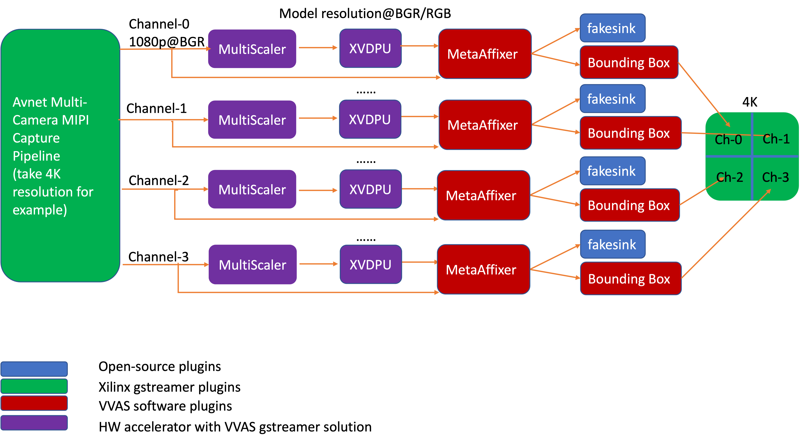

Accelerator - XVDPU
========================

This chapter provides the hardware and software architecture of the XVDPU
accelerator integrated into a platform.

Software Architecture
---------------------

The accelerator uses Vitis Video Analytics (VVAS) as a framework to realize tranform and AI-powered
solutions that can easily and seamlessly interface with other GStreamer elements such as video sources and sinks.
VVAS provides a simplified interface to developers, exposing certain API to program the accleration kernel without
having to worry about handeling buffer allocations.

**vvas_xabrscaler** is a plug-in that takes one input frame and can produce several outputs frames having different
resolutions and color formats. The vvas_xabrscaler is a GStreamer plug- in developed to accelerate the resize and
color space conversion functionality.

This plug-in supports:

 #. Single input, multiple output pads
 #. Color space conversion
 #. Resize
 #. Each output pad has independent resolution and color space conversion capability

**vvas_xfilter** is a generic VVAS infrastructure plugin that interact with the acceleration kernel through a set
of APIs exposed by an acceleration software library corresponding to that kernel.
An accelerator element has one source and one sink pad; vvas_xfilter can consume one temporal input
frame from its source pad, data transform and produce one output frame on its sink pad.
vvas_xfilter plug-in wraps the acceleration software library and prepares the acceleration software library handle
(vvasKernel) to be passed to the core APIs as shown in the figure.

The vvas_xfilter plug-in provide many input properties to config the kerenl. Below are significant

- kernels-config (mandatory) : Is a path to configuration file in JSON format and contains information required by the
  kernel, such as path to xclbin, acceleration software library and many more.

- dynamic-config (optional) : configures one or many input parameters of the kernel during runtime, refer to all
  parameters under config from the JSON file above.

**vvas_xmetaaffixer** is used to scale the incoming metadata information for the different resolutions. A machine learning
(ML) operation can be performed on a different frame resolution and color format than the original frame, but the metadata
might be associated with the full resolution, original frame.

below are the examples where VVAS framework is used with an acceleration software library developed for a XVDPU IP

For detailed documentaion of VVAS infrastructure plugins, plugin properties and JSON configuration file refer the below URL
https://xilinx.github.io/VVAS/index.html

Hardware Architecture
---------------------

Two HW modules in xvdpu example, Multiscaler (VVAS) and xvdpu (DPUCVDX8G). Multiscaler reads video frames from memory,
does resize and color space conversion, and writes the processed frames back into memory. The processed frames is the
input of xvdpu, which does the AI processing.

The Multiscaler kernel is HLS code that can be built using Vitis HLS and the compiled kernel is provided as .xo file.
xvdpu is RTL code and pre-built AIE's libadf.a files, the RTL code can be packaged using Vitis tool as .xo file.
The Vitis tool integrates the .xo files and libadf.a into the platform.

For detailed infomation about Multiscaler, please refer to https://xilinx.github.io/VVAS/docs/common/Acceleration-Hardware.html

For more information about xvdpu (DPUCVDX8G), please refer to the document PG389 'Xilinx Versal DPU (DPUCVDX8G) Product Guide'
https://www.xilinx.com/content/dam/xilinx/support/documentation/ip_documentation/dpucvdx8g/v1_0/pg389-dpucvdx8g.pdf.
Default configuraion of xvdpu in this example is C32B1L2S2, its main frequency is 333 MHz.

,,,,,

Licensed under the Apache License, Version 2.0 (the "License"); you may not use this file
except in compliance with the License.

You may obtain a copy of the License at
http://www.apache.org/licenses/LICENSE-2.0

Unless required by applicable law or agreed to in writing, software distributed under the
License is distributed on an "AS IS" BASIS, WITHOUT WARRANTIES OR CONDITIONS OF ANY KIND,
either express or implied. See the License for the specific language governing permissions
and limitations under the License.

