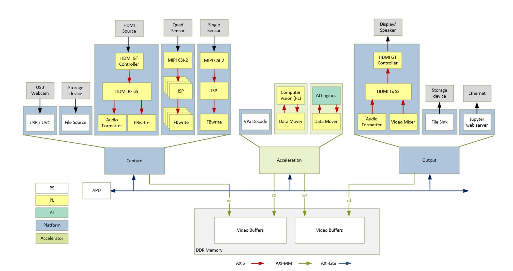
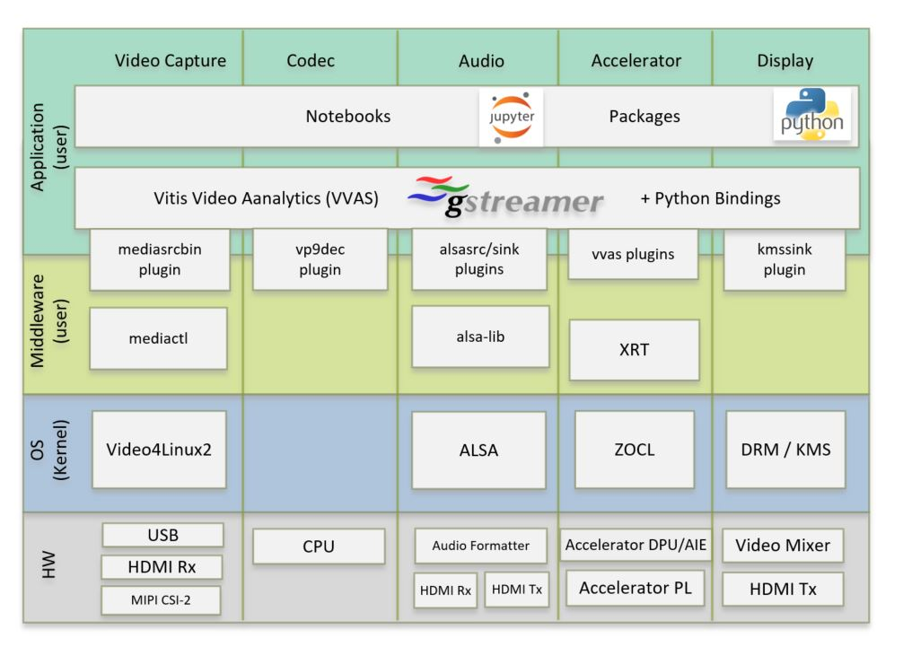

Introduction
============

The Versal Base TRD consists of a series of platforms, accelerators and Jupyter
notebooks to demonstrate various aspects of the design. A platform is a Vivado
design with a pre-instantiated set of I/O interfaces and a corresponding
PetaLinux BSP and image that includes the required kernel drivers and user-space
libraries to exercise those interfaces. Accelerators are mapped to FPGA logic
resources and/or AI Engine cores and stitched into the platform using the Vitis
toolchain. The reference designs from this release are supported with production
silicon only, for the VCK190 evaluation board.

.. _Platforms:

Platforms
---------

The following is a list of supported platforms including key I/O interfaces:

* Platform 1 - *vck190_mipiRxSingle_hdmiTx*:

  * Sources:

    * USB webcam capture pipeline

    * File source

    * MIPI CSI-2 image sensor capture pipeline via FMC daughter card, HDR enabled

  * Processing:

    * VP9 decode and demux

    * 2D Filter (PL)

    * XVDPU (PL + AIE)

  * Sinks:

    * HDMI Tx + video mixer display pipeline

    * Application sink into jupyter notebook display

* Platform 2 - *vck190_mipiRxQuad_hdmiTx*:

  Platform 2 is essentially an enhancement to platform 1 capture pipeline,
  while the rest of the hardware design and pre-instantiated set of I/O
  interfaces remain the same. The notable difference in the capture path is
  replacement of IMX274 image sensor with Avnet Multi-Camera image sensor.

* Platform 3 - *vck190_hdmiRx_hdmiTx*:

  Platform 3 uses HDMI RX in the capture pipeline, while the rest of the hardware
  design and pre-instantiated set of I/O interfaces remain the same. HDMI RX 
  is HDR10 capable and also supports capture of audio data.

  Audio replay can be done on all platforms. For Platform 1 and Platform 2 the 
  audio source is a file. In case of Platform 3 the audio source can be a either
  a file or  HDMI RX.

Software Stack
--------------

The main software frameworks used in this reference design are:

* Jupyter notebooks for top-level application control and visualization

* GStreamer multimedia framework and plugins for video pipeline creation

* V4L2 kernel subsystem and drivers for video capture devices

* Xilinx run-time (XRT) and Xilinx OpenCL for acceleration kernels

* DRM/KMS kernel subsystem and drivers for display devices

* ALSA kernel subsystem and drivers for audio devices

Working of above frameworks are detailed in Chapter 9.

High Dynamic Range Video
------------------------

Base TRD supports high dynamic range (HDR) video with capture and display pipelines,
following is a brief introduction. 

**Multi-exposure Digital Overlap High Dynamic Range (DOL-HDR) capture**

High dynamic range image is a technique obtained by combining several different 
exposures frames of the same subject matter. IMX274 camera sensor supports 
capturing objects at two different exposure, HDR extract IP segregates the 
sensor data (DOL data) into short and long exposure frames. HDR merge will 
generate the HDR frame form the data obtained. The HDR frame results in an image
with a greater dynamic range than what is possible by taking one single exposure. 
HDR is useful for recording many real-world scenes containing very bright, 
direct sunlight to extreme shade.

**Note:**

- Only Platform 1 has the ability to capture HDR frames.

- 4k HDR video in platform 1 has a max framerate of 30fps, limited by the sensor.

**High Dynamic Range Display (HDR10)**

The dynamic range of a display refers to its luminance, the maximum and minimum
amount of light the display is capable of producing. High dynamic range(HDR) is 
the capability to represent a large luminance variation in the video signal, i.e.,
from very dark values (0.00005 cd/m2) to very bright values (greater  than
1000 cd/m2). HDR creates brighter whites, darker blacks, and brighter colors
that better match images we see in the real world. HDR10 uses ST2084 EOTF,
a single content layer with static metadata, this static metadata information is
supported in the underlying infrastructure of the platform 3 TRD 
*vck190_hdmiRx_hdmiTx* mentioned above, where both source and sink elements are
HDR10 capable (HDMI-RX and HDMI-TX). 

Design Files
---------------------

The design source files are available at https://github.com/Xilinx/vck190-base-trd.git
It has the following contents:

* Petalinux Board Support Package (BSP)

* Vivado hardware platform projects

* Vitis accelerator overlay projects

* HTML Documentation sources

* README file

The design file hierarchy is shown below:

.. code-block:: bash

   vck190-base-trd
   ├── docs
   ├── overlays
   │   ├── filter2d
   │   │   ├── apps
   │   │   │   └── filter2d-notebooks
   │   │   └── kernels
   │   │       ├── filter2d_aie
   │   │       ├── filter2d_combined
   │   │       └── filter2d_pl
   │   ├── Vitis_Libraries
   │   │   └── vision
   │   └── xvdpu
   │       ├── apps
   │       │   └── smart-mipi-app
   │       └── kernels
   │           ├── vitis_prj
   │           └── xvdpu_ip
   ├── petalinux
   │   └── xilinx-vck190-base-trd
   ├── platforms
   │   ├── scripts
   │   └── vivado
   │       ├── ip
   │       ├── vck190_hdmiRx_hdmiTx
   │       ├── vck190_mipiRxQuad_hdmiTx
   │       └── vck190_mipiRxSingle_hdmiTx
   └── README.md

In the following tutorials, it is assumed that the design source files are cloned
into a directory referred to as ``$working_dir``, e.g.

.. code-block:: bash

   export working_dir=/path/to/cloned/repo/vck190-base-trd

Licenses
--------

The design includes files licensed by Xilinx and third parties under the terms
of the GNU General Public License, GNU Lesser General Public License,
BSD License, MIT License, and other licenses. The file
`vck190_base_trd_third_party_licenses_and_source_2022_1.tar.gz
<https://www.xilinx.com/bin/public/openDownload?filename=vck190_base_trd_third_party_licenses_and_source_2022_1.tar.gz#>`_
contains the complete set of design source files and licenses. You are solely
responsible for checking any files you use for notices and licenses and for
complying with any terms applicable to your use of the design and any third
party files supplied with the design.

,,,,,

Licensed under the Apache License, Version 2.0 (the "License"); you may not use this file
except in compliance with the License.

You may obtain a copy of the License at
http://www.apache.org/licenses/LICENSE-2.0

Unless required by applicable law or agreed to in writing, software distributed under the
License is distributed on an "AS IS" BASIS, WITHOUT WARRANTIES OR CONDITIONS OF ANY KIND,
either express or implied. See the License for the specific language governing permissions
and limitations under the License.

