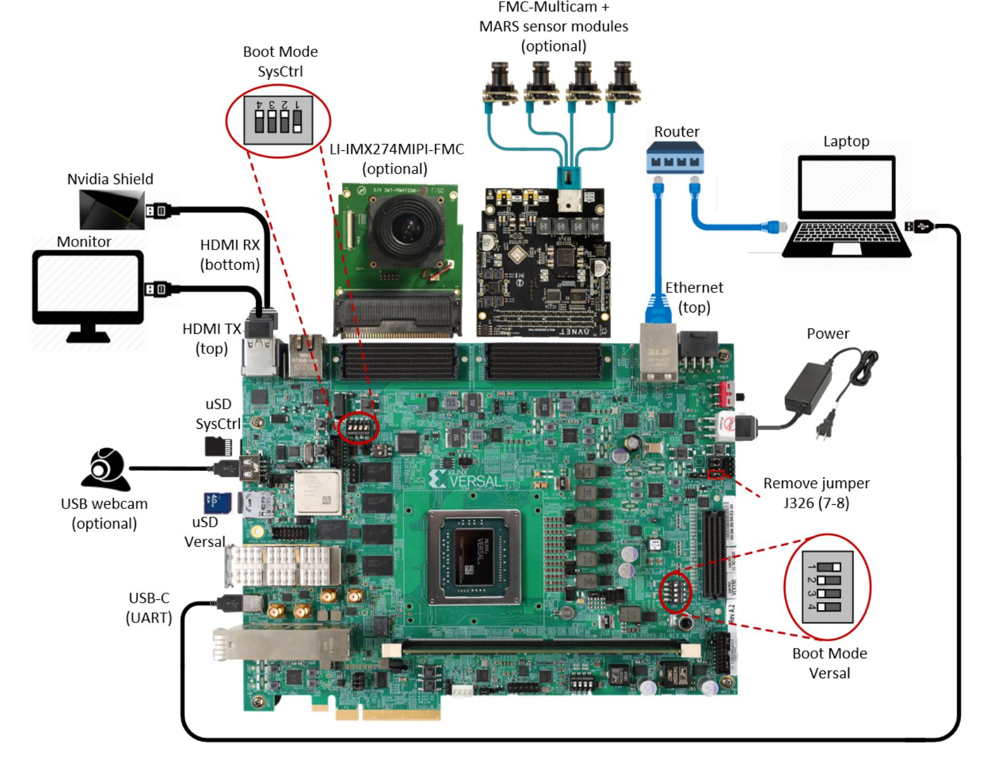

Board and System settings
=========================

Prerequisites
-------------

* Prebuilt SD Image zip file

* Terminal emulator, for example

  * Windows: teraterm (https://osdn.net/projects/ttssh2)

  * Linux: picocom (https://github.com/npat-efault/picocom/releases)

* Windows: Win32 Disk Imager utility (https://sourceforge.net/projects/win32diskimager)

* Windows: 7zip utility (https://sourceforge.net/projects/sevenzip/)

Reference Design SD Card Creation
---------------------------------

The reference design prebuilt SD image zip files can be downloaded from the below locations. Note
there is a separate zip file per platform:

.. csv-table:: **Table 1: SD Image zip files**
	:file: ../tables/wic_links.csv
	:widths: 50, 25, 25
	:header-rows: 1

Unzip the downloded file. This should contain the zipped wic image ``petalinux-sdimage.wic.xz``
and a readme file pointing to Third party licenses and sources associated with this image.

Choose an unpartitioned SD card of size 8GB or greater for this demo. Use the
*Win32 Disk Imager* utility for Windows or 'dd' command line utility for Linux
to write the given raw disk image ``petalinux-sdimage.wic`` to the SD card.

After unzipping the image file ``petalinux-sdimage.wic.xz`` using the 7zip
utility on Windows, use the following steps to write a raw disk image to a
removable device using the Win32 Disk Imager utility.

#. Browse to the location of the unzipped image in the Win32 utility. In the
   'File name' field, type ``*.wic``, otherwise only files with the ``.img``
   ending file be shown. Alternatively, change the drop down menu on the bottom
   right from 'Disk Images (\*.img \*.IMG)' to '\*.\*'.

#. Choose the correct SD card drive letter under 'Device'

#. Select 'Write' to the SD card, click 'Yes' at the prompt to continue writing
   and wait till the operation is complete

   .. image:: ../images/win32.jpg
      :width: 500px
      :alt: Win32 Image

Steps to write a raw disk image to a removable device using dd command-line
utility for Linux

#. unzip the given image file ``petalinux-sdimage.wic.xz`` in linux

#. Use dd to write ``petalinux-sdimage.wic`` to correct enumerated disk for SD
   card in the Linux machine:

   .. code-block:: bash

      unxz petalinux-sdimage.wic.xz
      sudo dd if=petalinux-sdimage.wic of=/dev/sdbx bs=1M

**SD card partitions**

Once the raw image is written to the SD card, you will be able to see two
partitions. The first partition (FAT16 format) is the boot partition and it
contains:

* Xilinx OpenCL binary container (``binary_container_1.xclbin``)
* Boot image (``BOOT.BIN``)
* u-boot boot script (``boot.scr``)
* Linux kernel image (``image.ub``)
* Initial filesystem in ramdisk (``ramdisk.cpio.gz.u-boot``)

while in the second patition (ext4 format) resides the root file system.

**Note:** A Windows OS would only allow FAT16 partitions to be viewed whereas
the ext4 format is not recognized.

System Controller
-----------------

.. note::

   If you think that you have the correct System Controller (SC) SD Image then this section
   can be skipped.

**ES Silicon**

The image and instructions to write to the SC SD card can be downloaded from the
VCK190 headstart lounge.

* SC SD Image: https://www.xilinx.com/member/vck190_headstart/Board_Framework_Phase1Beta_V1.02_wVadj.img.zip

* Instructions: https://www.xilinx.com/member/vck190_headstart/Update_System_Controller_uSD_Card_Instructions.pdf

**Production Silicon**

The image (Beta  2.1) and instructions to write to SC SD card are avaialble on the Beam Tool page

* SC SD Image: https://www.xilinx.com/member/forms/download/xef.html?filename=intermediate_petalinux-sdimage.zip

* Instructions: http://wiki.xilinx.com/BEAM+Tool+for+VCK190+Evaluation+Kit

.. _Board Setup:

Board Setup
-----------

The following figure shows how to set up the VCK190 evaluation board.

**Board jumper and switch settings**

This is a onetime setup and the board should have been delivered to you with
this default settings, but it is good to double check for the first time when
you get the board.

* Make sure you remove J326 (7-8) jumper.

* Setup SYSCTRL Boot mode switch SW11 to (ON,OFF,OFF,OFF) from switch bits
  1 to 4 as shown in the above picture.

* Make sure you have the SYSCTRL uSD card inserted in the slot and card has the
  SYSCTRL image.

* Setup Versal Boot Mode switch SW1 to (ON,OFF,OFF,OFF) from switch bits 1 to 4
  as shown in the above picture.

**MIPI and HDMI connections**

Make the connections based on the SD Image selected.

vck190_mipiRxSingle_hdmiTx supports video capture from the Leopard IMX274 MIPI FMC,
connect the FMC card to the FMCP1 slot (J51) as shown in the above figure.
For more info on the FMC module, visit:
https://leopardimaging.com/product/csi-2-mipi-modules-i-pex/li-imx274mipi-fmc/

vck190_mipiRxQuad_hdmiTx supports video capture from Avnet Multi-Camera MIPI FMC Module.
Connect the FMC card to the FMCP2 slot (J53) as shown in the above figure.
For more info on the FMC module, visit:
https://www.avnet.com/wps/portal/silica/products/new-products/npi/2018/avnet-multi-camera-fmc-module/

vck190_hdmiRx_hdmiTx supports video capture via HDMI RX.
Connect the HDMI cable as shown in the above figure. Connect the other end of the cable to a HDMI source
like a laptop or Nvidia Shield or Roku

**Serial console settings**

VCK190 comes with a USB-C connector for JTAG+UART, when connected three UART
ports should be visible in Device Manager:

* Versal UART0

* Versal UART1 &

* System Controller UART

Connect a USB-C cable to the USB-UART connector. Open two terminal emulator windows. Choose
Versal UART0 on one and System Controller UART on the other and use the following settings
on the Serial Port:

* Baud Rate: 115200

* Data: 8 bit

* Parity: None

* Stop: 1 bit

* Flow Control: None

**Vadj settings**

Perform the following steps to set the Vadj voltage rail to 1.2V using the
*BoardUI/Board Interface Test(BIT)* utility:

Note: This is required only if using MIPI Single or Quad sensors.

#. Power on the board.

   Note: Skip next 2 steps for ES silicon

#. On the  System Controller UART terminal type the following commands at
   the linux prompt. This will allow the *BoardUI/Board Interaface Test* utility
   to communicate with the System Controller. For more information refer to
   http://wiki.xilinx.com/BEAM+Tool+for+VCK190+Evaluation+Kit

   .. code-block:: bash

      EXT<Enter key><Tab Key>
      sed -i -e 's/^#//' /etc/init.d/start_boardframework.sh
      /etc/init.d/start_boardframework.sh

#. Close the System Controller UART terminal

#. Download the *BoardUI/Board Interface Test(BIT)* tool from the following link:

   * `VCK190 Board Interface Test : rdf0574-vck190-bit-c-2020-2.zip <https://www.xilinx.com/member/forms/download/design-license.html?cid=b83eede2-f9d2-4e81-a393-67a1a8ba609e&filename=rdf0574-vck190-bit-c-2020-2.zip>`_

#. Extract the zip file and start the *BoardUI/Board Interface Test(BIT)* tool
   by clicking on *BoardUI.exe*. Make sure the USB-C
   cable is connected to your PC and the system controller Micro SD card is
   inserted. Also make sure you Vivado Design Suite HW Manager is installed on
   the host machine.

#. In the *BoardUI* GUI, navigate to the *FMC Boot Up* tab following the red
   circles as shown in the below figure. Enter *1.2* in the *Set On-Boot VADJ*
   field and click the button next to it to save the value.

   .. image:: ../images/boardui.jpg
      :width: 900px
      :alt: BoardUI Utility

#. Power-cycle the board and navigate to the *FMC Current* tab. Click the
   *Get VADJ_FMC Voltage* button to read out the current voltage setting and
   confirm it matches the 1.2V set in the previous step.

#. Close the *BoardUI* utility.

.. note::

   If Vadj does not persists after reboot, try updating the System Controller
   SD card image (Instructions provided in the System Controller section of
   this tutorial).

,,,,,

Licensed under the Apache License, Version 2.0 (the "License"); you may not use this file
except in compliance with the License.

You may obtain a copy of the License at
[http://www.apache.org/licenses/LICENSE-2.0](http://www.apache.org/licenses/LICENSE-2.0)

Unless required by applicable law or agreed to in writing, software distributed under the
License is distributed on an "AS IS" BASIS, WITHOUT WARRANTIES OR CONDITIONS OF ANY KIND,
either express or implied. See the License for the specific language governing permissions
and limitations under the License.
