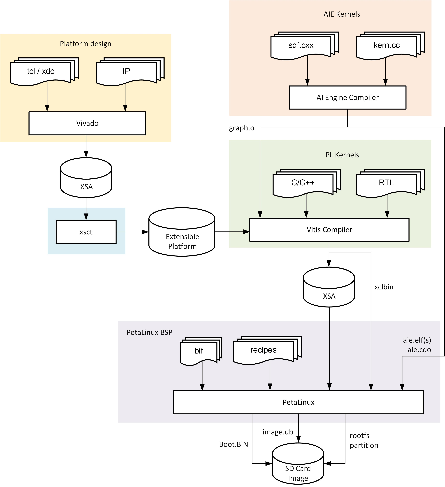

Tool Flow Overview
==================

The overall tool flow is outlined in the below diagram. Each step in the tool
flow is exlpained in detail in subsequent build tutorials.

At a high level, the builds steps are as follows:

#. **Vivado platform design:**
   The Vivado design is augmented with platform parameters that describe the
   meta data and physical interfaces available to the Vitis compiler for
   stitching in PL and/or AIE kernels.

#. **Platform creation:**
   The XSCT utility is used to create an extensible platform whose main
   component is the XSA created by Vivado in step 1.

#. **AIE kernels:**
   The Cardano tool chain is used to compile AI Engine kernels. It also
   generates a graph description which is consumed by the Vitis toolchain during
   the link step.

#. **PL kernels:**
   The Vitis tool chain is used to compile accelerator kernels from C/C++ using
   high-level synthesis (HLS) or to package RTL kernels. The Vitis linker
   integrates the kernels into the platform design and generates a new XSA and
   xclbin as output products.

#. **PetaLinux BSP:**
   The PetaLinux BSP is a collection of yocto meta layers and recipes that are
   used to generate a bootable SD card image including boot image components
   (BOOT.BIN), Linux image (image.ub) and external root filesystem partition
   (rootfs). The rootfs contains a collection of software packages required to
   run the target applications.

