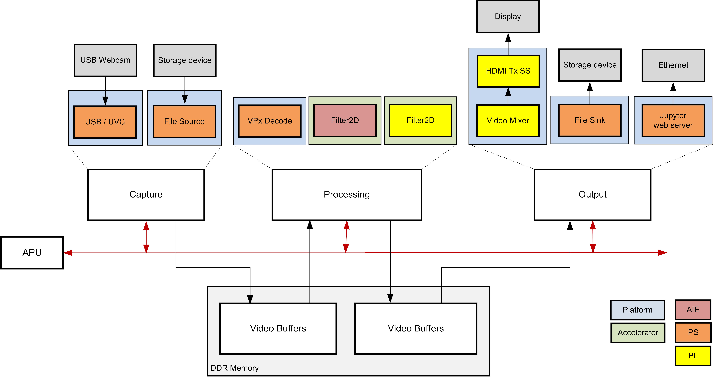
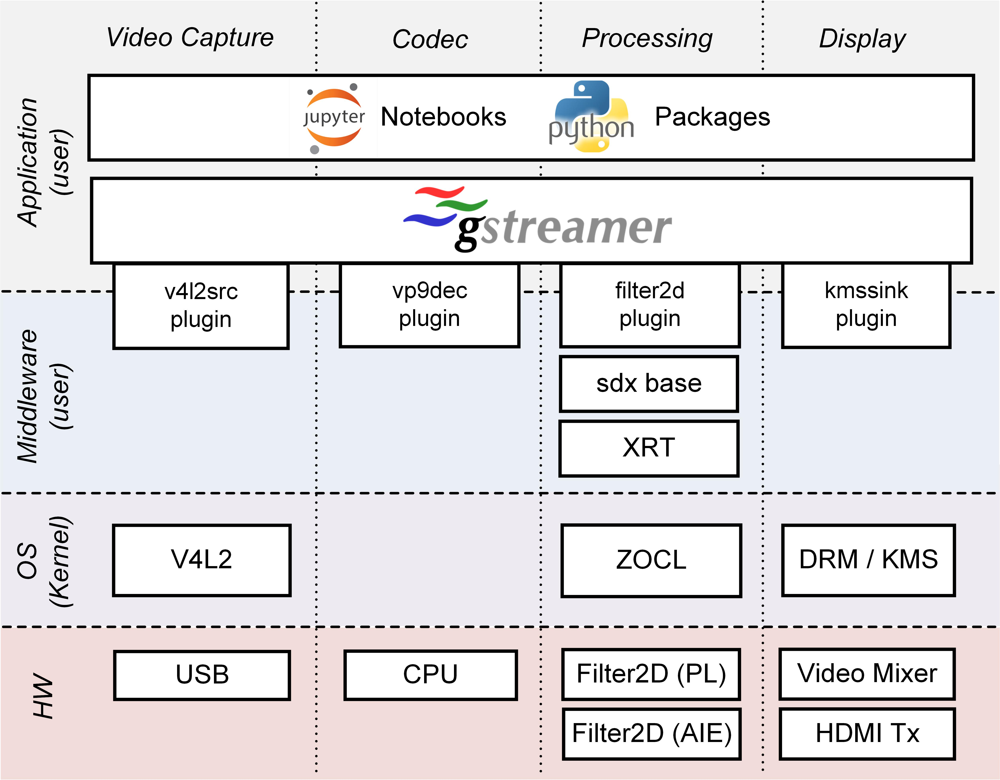

Introduction
============

The Versal Base TRD consists of a series of platforms, accelerators and Jupyter
notebooks to demonstrate various aspects of the design. A platform is a Vivado
design with a pre-instantiated set of I/O interfaces and a corresponding
PetaLinux BSP and image that includes the required kernel drivers and user-space
libraries to exercise those interfaces. Accelerators are mapped to FPGA logic
resources and/or AI Engine cores and stitched into the platform using the Vitis
toolchain. The reference design currently supports the VCK190 evaluation board.

Platforms
---------

The following is a list of supported platforms including key I/O interfaces:

* Platform 1:

  * Sources:

    * USB webcam capture pipeline

    * File source

    * MIPI CSI-2 image sensor capture pipeline via FMC daughter card

  * Processing:

    * VP9 decode and demux

    * 2D Filter (PL)

    * 2D Filter (AIE)

  * Sinks:

    * HDMI Tx + video mixer display pipeline

    * Application sink into jupyter notebook display

* Platform 2:

  Platform 2 is essentially an enhancement to platform 1 capture pipeline, 
  while the rest of the hardware design and pre-instantiated set of I/O 
  interfaces remain the same. The notable difference in the capture path is
  replacement of IMX274 image sensor with Avnet Multi-Camera image sensor.

Software Stack
--------------

The main software frameworks used in this reference design are:

* Jupyter notebooks for top-level application control and visualization

* GStreamer multimedia framework and plugins for video pipeline creation

* V4L2 kernel subsystem and drivers for video capture devices

* Xilinx run-time (XRT) and Xilinx OpenCL for acceleration kernels

* DRM/KMS kernel subsystem and drivers for display devices

Design File Hierarchy
---------------------

The reference design zip file can be downloaded from
https://www.xilinx.com/member/forms/download/xef.html?filename=vck190_base_trd_platform1_2020.1_v0.4.zip

It has the following contents:

* Documentation (html webpages)

* Petalinux Board Support Package (BSP)

* Pre-built SD card image

* Vivado hardware design project

* Vitis platform

* Vitis accelerator projects

* README file

* Design sources zip file

* Licenses zip file

The design file hierarchy is shown below:

.. code-block::

   vck190_base_trd_platform1_2020.1_v0.4
   ├── accelerators
   │   ├── examples
   │   │   ├── filter2d_aie
   │   │   ├── filter2d_combined
   │   │   └── filter2d_pl
   │   ├── LICENSE
   │   └── vitis_libraries
   │       └── vision
   ├── docs
   │   ├── doctrees
   │   ├── html
   │   └── index.html
   ├── licenses.zip
   ├── petalinux
   │   └── xilinx-vck190-qspi-base-trd-2020.1-v0.4.bsp
   ├── platform
   │   ├── pfm.tcl
   │   └── vck190_base_trd_platform1
   ├── README.txt
   ├── sdcard
   │   └── sdcard.img.zip
   ├── sources.zip
   └── vivado
       ├── scripts
       └── xdc

Licenses
--------

The design includes files licensed by Xilinx and third parties under the terms
of the GNU General Public License, GNU Lesser General Public License,
BSD License, MIT License, and other licenses. The design directory includes one
zip file named ``sources.zip`` containing the complete set of design source
files and one zip file named ``licenses.zip`` containing licenses extracted from
the design source files. You are solely responsible for checking any files you
use for notices and licenses and for complying with any terms applicable to your
use of the design and any third party files supplied with the design.

