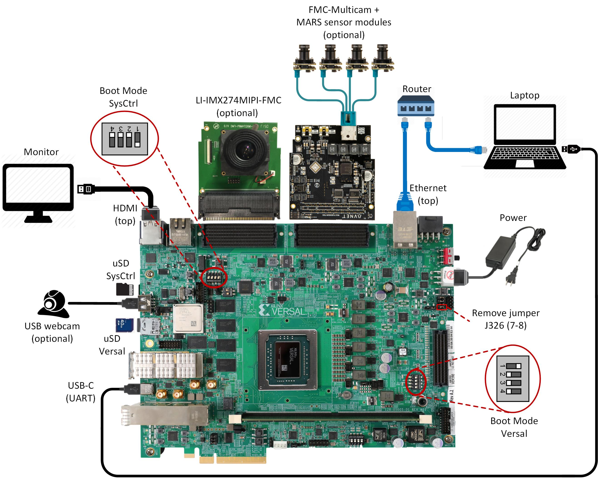

Run the Prebuilt Image
======================

Prerequisites
-------------

* Reference design zip file

* Terminal emulator, for example

  * Windows: teraterm (https://osdn.net/projects/ttssh2)

  * Linux: picocom (https://github.com/npat-efault/picocom/releases)

* Windows: Win32 Disk Imager utility (https://sourceforge.net/projects/win32diskimager)

SD Card Creation
----------------

Choose an unpartitioned SD card of size 8GB or greater for this demo. Use the
*Win32 Disk Imager* utility for Windows or 'dd' command line utility for Linux
to write the given rawdisk image ``sdcard.img`` to the SD card.

After unzipping the image file ``sdcard.img.zip`` using windows extractor, use
the following steps to write a raw disk image to a removable device using the
Win32 Disk Imager utility.

#. Browse to the location of the unzipped image in the Win32 utility

#. Choose the correct SD card under 'device'

#. Select 'Write' to the SD card, click 'Yes' at the prompt to continue writing
   and wait till the operation is complete

   .. image:: images/win32.png
      :width: 800px
      :alt: Win32 Image

Steps to write a raw disk image to a removable device using dd command-line
utility for Linux

#. Unzip the given image file ``sdcard.img.zip`` in linux

#. Use dd to write ``sdcard.img`` to correct enumerated disk for SD card in the
   Linux machine:

   .. code-block:: bash

      unzip sdcard.img.zip
      sudo dd if=sdcard.img of=/dev/sdbx bs=1M

**SD card partitions**

Once the raw image is written to the SD card, you will be able to see two
partitions. In the first partition (FAT32 format) resides:

* Xilinx OpenCL binary container (``binary_container_1.xclbin``)
* Boot image (``BOOT.BIN``)
* u-boot boot script (``boot.scr``)
* Linux kernel image (``image.ub``)

while in the second patition (ext4 format) resides the root file system.

**Note:** A Windows OS would only allows FAT32 partitions to be viewed, which is
the boot partition, whereas ext4 format is not recognized.

Board Setup
-----------

The following figure shows how to set up the VCK190 evaluation board.

**Board jumper and switch settings**

This is a onetime setup and the board should have been delivered to you with
this default settings, but it is good to double check for the first time when
you get the board.

* Make sure you remove J326 (7-8) jumper.

* Setup SYSCTRL Boot mode switch SW11 to (ON,OFF,OFF,OFF) from switch bits
  1 to 4 as shown in the above picture.

* Make sure you have the SYSCTRL uSD card inserted in the slot and card has the
  SYSCTRL image.

* Setup Versal Boot Mode switch SW1 to (ON,OFF,OFF,OFF) from switch bits 1 to 4
  as shown in the above picture.

**FMC and Vadj settings**

Platform 1 supports video capture from the Leopard IMX274 MIPI FMC,
connect the FMC card to the FMCP1 slot (J51) as shown in the above figure.

Platform 2 supports video capture from Avnet Multi-Camera MIPI FMC Module.
Connect the FMC card to the FMCP2 slot (J53) as shown in the above figure.

More details on the FMC can be found at:
Platform1 FMC: https://leopardimaging.com/product/csi-2-mipi-modules-i-pex/li-imx274mipi-fmc/
Platform2 FMC: https://www.avnet.com/wps/portal/silica/products/new-products/npi/2018/avnet-multi-camera-fmc-module/

Perform the following steps to set the Vadj voltage rail to 1.2V using the
*BoardUI* utility:

* Depending on whether you have downloaded this reference design through the
  VCK190 Headstart or EA lounge, use one of the two weblinks below to download
  the *BoardUI* utility:

  * EA Lounge: https://www.xilinx.com/member/vck190-ea/VCK190_BIT_Test_20191014.zip

  * Headstart Lounge: https://www.xilinx.com/member/vck190_headstart/VCK190_BIT_Test_20191014.zip

* Extract the zip file and start the *BoardUI* tool. Make sure the USB-C
  cable is connected to your PC and the system controller Micro SD card is
  inserted.

* In the *BoardUI* GUI, navigate to the *FMC Boot Up* tab following the red
  circles as shown in the below figure. Enter *1.2* in the *Set On-Boot VADJ*
  field and click the button next to it to save the value.

  .. image:: images/boardui.jpg
     :width: 900px
     :alt: BoardUI Utility

* Power-cycle the board and navigate to the *FMC Current* tab. Click the
  *Get VADJ_FMC Voltage* button to read out the current voltage setting and
  confirm it matches the 1.2V set in the previous step.

* Close the *BoardUI* utility.

**Serial console settings**

VCK190 comes with a USB-C connector for JTAG+UART, when connected three UART
ports should be visible in Device Manager:

* Versal UART0

* Versal UART1 &

* System Controller UART

Connect a USB-C cable to the USB-UART connector. In the terminal emulator choose
Versal UART0 and use the following settings:

* Baud Rate: 115200

* Data: 8 bit

* Parity: None

* Stop: 1 bit

* Flow Control: None

Connect to the JupyterLab Server
--------------------------------

Follow these steps to boot the board into Linux

* Ensure all steps under the section 'Board jumper and switch settings' are
  verified.

* Insert the prepared micro SD card into the Versal SD card slot (refer to the
  image VCK190 Board Setup)

* Make physical connections to ethernet, HDMI, UART, webcam and power as shown
  in the image.

* Have the UART0 terminal emulator tab connected.

* Turn ON power switch SW13.

* On Versal UART0 terminal, we would see the Versal device booting from the
  micro SD card starting with the message
  "Xilinx Versal Platform Loader and Manager"

* In about 60 seconds boot is complete. Observe the Linux prompt
  *root@xilinx-vck190-qspi-2019_2* and autostart of JupyterLab server as shown
  in the example below:

  .. code-block:: bash

     root@xilinx-vck190-qspi-2019_2:~#
     [W 02:30:21.552 LabApp] JupyterLab server extension not enabled, manually loading...
     [I 02:30:21.571 LabApp] JupyterLab extension loaded from /usr/lib/python3.5/site-packages/jupyterlab
     [I 02:30:21.572 LabApp] JupyterLab application directory is /usr/share/jupyter/lab
     [I 02:30:21.580 LabApp] Serving notebooks from local directory: /usr/share/notebooks
     [I 02:30:21.581 LabApp] The Jupyter Notebook is running at:
     [I 02:30:21.581 LabApp] http://172.19.1.246:8888/?token=c46d443a39d2648046afdbb9bc5821177ab7cd386c218103
     [I 02:30:21.581 LabApp] Use Control-C to stop this server and shut down all kernels (twice to skip confirmation).
     [C 02:30:23.092 LabApp]

      To access the notebook, open this file in a browser:
          file:///home/root/.local/share/jupyter/runtime/nbserver-1889-open.html
      Or copy and paste one of these URLs:
          http://172.19.1.246:8888/?token=c46d443a39d2648046afdbb9bc5821177ab7cd386c218103

Follow these steps to connect to the jupyter-server using Chrome browser on the
laptop.

**Note:** This demo is tested with Chrome browser only.

* Copy the generated URL with token on the prompt of Versal target and paste it
  to the browser address bar of the laptop, for example:

  .. code-block:: bash

      http://172.19.1.246:8888/?token=c46d443a39d2648046afdbb9bc5821177ab7cd386c218103

  **Note:** If for any reason target fails to grab an IP address from the
  network, Jupyter server would fail to issue an URL. In such a case user is
  recommended to fix an IP address and restart the jupyter server as shown
  below:

  .. code-block:: bash

     /etc/init.d/jupyterlab-server stop
     /etc/init.d/jupyterlab-server start

* To look up the jupyter server IP address and token on the target, run:

  .. code-block:: bash

     jupyter notebook list

Setting a private network
^^^^^^^^^^^^^^^^^^^^^^^^^
In case of a private network, user may have to assign a static address within
the subnet of the host machine, this section can be skipped if you are using
DHCP and not on a private network

**Setting up a private network with target board and the host machine for
Windows users:**

* Make a direct connection between the windows host machine and the target
  board using an ethernet cable

* In windows, run command prompt as an admisntrator

  .. code-block:: bash

     Press Windows+R to open the “Run” box.
     Type “cmd” into the box.
     press Ctrl+Shift+Enter to run the command as an administrator

* Run ipconfig on the windows machine to list available ethernet adapters and
  set a static private ip

  .. code-block:: bash

     # A sample output after executing ipconfig
     # notice interface "Ethernet" has an auto address assigned with no Default Gateway

     ipconfig

     Ethernet adapter Ethernet:

        Connection-specific DNS Suffix  . :
        Link-local IPv6 Address . . . . . : fe80::1d8d:ac40:ff9b:8d1%21
        Autoconfiguration IPv4 Address. . : 169.254.8.209
        Subnet Mask . . . . . . . . . . . : 255.255.0.0
        Default Gateway . . . . . . . . . :

     # Set static ip address
     netsh interface ip set address name="YOUR INTERFACE NAME" static "IP_ADDRESS" "SUBNET_MASK"

     # Example
     netsh interface ip set address name="Ethernet" static 10.0.0.1 255.255.255.0

* Set a private ip address for the target within the subnet of host machine and
  verify connectivity.

  .. code-block:: bash

     ifconfig eth0 10.0.0.2 netmask 255.255.255.0

     # Perform a ping test to the host form the target
     ping -c 3 10.0.0.1

**Setting up a private network with target board and the host machine for Linux
users:**

* Make a direct connection between the Linux host machine and the target board
  using an ethernet cable

* Run ifconfig on the Linux machine to list available ethernet adapters and set
  a static private ip

  .. code-block:: bash

     # Example to set an ip 10.0.0.1 to ethernet interface enp2s0:
     sudo ifconfig enp2s0 10.0.0.1 netmask 255.255.255.0

* Set a private ip address for the target within the subnet of host machine and
  verify connectivity.

  .. code-block:: bash

     ifconfig eth0 10.0.0.2 netmask 255.255.255.0

     # Perform a ping test to the host form the target
     ping -c 3 10.0.0.1

Run the Jupyter Notebooks
-------------------------

This TRD includes the following jupyter notebooks:

#. **base-trd-nb1.ipynb**: Demonstrates videoplayback of a file source in rootfs
   of the target to the Jupyter notebook using the GStreamer multimedia
   framework.

#. **base-trd-nb2.ipynb**: Demonstrates streaming video from a v4l2 device on
   the target to the Jupyter notebook using the GStreamer multimedia framework

#. **base-trd-nb3.ipynb**: Demonstrates streaming video from a v4l2 device on
   the target to a HDMI monitor using the GStreamer multimedia framework.

#. **base-trd-nb4.ipynb**: Demonstrates two simultaneous streaming pipelines,
   one from file source and another from a v4l2 device onto two individual
   planes of a HDMI monitor using the GStreamer multimedia framework.

#. **base-trd-nb5.ipynb**: Demonstrates streaming video from a Mulit-Camera FMC
   module on the target to a HDMI monitor using the GStreamer multimedia framework.

#. **base-trd-nb6.ipynb**: Demonstrates the 2D filter accelerator kernels, both
   the PL and the AIE versions, inserted into the video pipeline of notebook 2.

#. **base-trd-nb7.ipynb**: Demonstrates using both 2D filter accelerator kernels
   in a time-multiplexed fashion in a multi-branch pipeline.

#. **base-trd-apm.ipynb**: Demonstrates how to plot the memory bandwidth while
   a video pipeline is running using the libxapm library with python bindings.

**Note:** MIPI sources in the notebook is platform specific, User is allowed to
choose "mipi" in platform 1 and "mipi_quad" in platform 2 respectively,
otherwise an exception would be thrown.

To run the notebooks, follow the below steps:

#. On the left pane of the browser, 4 notebooks are available under the folder
   Base TRD.

#. Double click to open the notebook

#. Select 'Kernel' → 'Restart Kernel and Run All Cells' from the top menu bar to
   run the demo. Scroll down to the end of the notebook to see the video output.

#. Click the rectangular icon to interrupt the kernel and stop the video stream.

#. Select 'Kernel' → 'Shutdown Kernel' → close the notebook tab and move to the
   next notebook.

   .. image:: images/jnbh.png
      :width: 1000px
      :alt: Jupyter_nb_home
